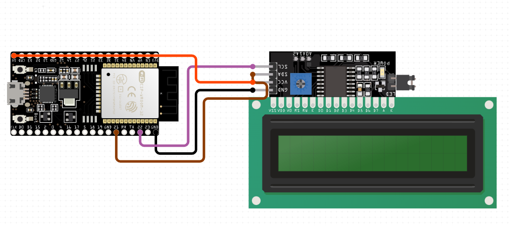
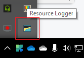
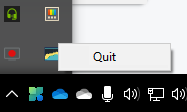
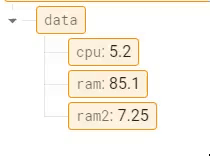

# ESP32-System-Usage-Monitor

ESP32 based System Usage Monitor written in python with firebase RTDB.

### ESP32 Schematic



### How to run

```shell
python systemResMon.py
```

Enter database link and database secret key to the ESP32 code inside ESP32 folder

upload it and connect LCD according to schematic .

##### System Tray icon



### How to Exit



### Screenshots



